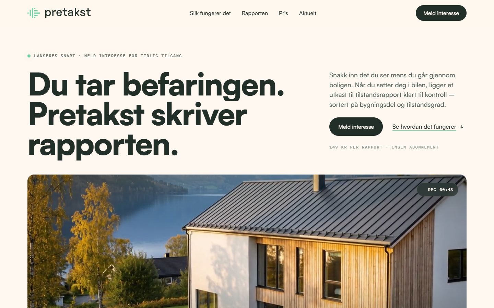

# Pretakst forside

Forslag til ny forside for [pretakst.no](https://pretakst.no), laget 4. september 2026.
Hele siden ligger i én selvstendig fil, `pretakst-forside.html`, med Satoshi-fontene, logoen, bildene og hero-videoen innebygd som data-URI-er. Filen kan åpnes rett i nettleseren.



## Innhold

| Sti | Hva |
| --- | --- |
| `pretakst-forside.html` | Ferdig bygget side (leveransen) |
| `src/forside.template.html` | Kildemalen. `{{asset:…}}` byttes ut med data-URI-er ved bygging |
| `assets/web/` | Komprimerte bilder (WebP/JPEG) og hero-videoen i 720p H.264 (1,1 MB) |
| `assets/fonts/` | Satoshi 400/500/700/900 (TTF), hentet fra dagens pretakst.no |
| `assets/*.svg`, `assets/*.png` | Originalbilder fra dagens pretakst.no |
| `tools/build.js` | Bygger `pretakst-forside.html` og `dist/pretakst-forside.artifact.html` |
| `tools/guard.js` | Regex som stopper bygget hvis teksten nevner Norsk takst eller integrasjoner |
| `tools/serve.js` | Statisk server (lokalt og i produksjon), port fra `PORT` eller 3000 |
| `index.html` | Kopi av den ferdige siden, for statisk hosting |
| `tools/shot.js` | Fullside-skjermbilder (desktop 1440 og mobil 390) via Chrome |
| `tools/resize.js` | Lager de komprimerte bildene i `assets/web/` |
| `forhandsvisning-*.png` | Skjermbilder av sluttresultatet |

## Bygge og se siden

```bash
npm install
npm run build
npm run serve
```

Åpne <http://localhost:3000>. Skjermbilder til gjennomgang lages med `npm run shots` (krever Chrome installert; `tools/shot.js` leter etter Chrome og Edge på standardplasseringer).

## Hosting (Coolify / Nixpacks)

Repoet kan deployes direkte som Node-app med Nixpacks:

- `npm start` kjører `tools/serve.js`, som serverer den ferdige siden på `PORT` (standard 3000). Sett «Ports Exposes» til 3000 i Coolify.
- Nixpacks kjører `npm run build` automatisk, så siden bygges på nytt fra malen ved hver deploy.
- `/health` svarer `ok` og kan brukes som healthcheck.
- Alternativ: huk av «Is it a static site?» og sett Publish Directory til `/`. `index.html` i roten er identisk med `pretakst-forside.html`.

Hero-videoen ble generert med Kling 3.0 pro via Higgsfield fra et stillbilde laget med Nano Banana Pro, og komprimert med ffmpeg:

```bash
ffmpeg -i hero-original.mp4 -vf "scale=1280:-2" -c:v libx264 -preset slow -crf 27 -pix_fmt yuv420p -movflags +faststart -an assets/web/hero.mp4
```

## Designvalg

- Brand-tokens fra dagens side: krem `#FFF8F0`, mørkegrønn `#222F29`, mint `#71D2A7`, teal `#78FFC1`, lilla `#724CE5`, font Satoshi. IBM Plex Mono (Google Fonts) brukes til metadata.
- Retningen er «feltrapporten som våkner til liv»: rapportens eget språk (bygningsdel, lokasjon, tilstandsgrad TG0–TG3, monospace-metadata) er sidens ornamentikk.
- Hero: stor typografisk overskrift, bred videoflate og et demokort som viser «Du sa → Rapporten» med observasjoner som matcher huset i videoen.
- Rapportforsiden i seksjonen «Rapporten» er bygget i HTML med samme hus og datoer som resten av siden.
- To bakgrunner (krem og mørkegrønn), én radius per rolle, TG-chips i én størrelse.
- Prosessen fulgte Lenny's Newsletter-artikkelen «How to turn your AI into a world-class designer»: seed-streng for retning, ambisiøs brief, uavhengig kritiker-agent som bare fikk skjermbilder (to runder), video lagt inn i UI, og bevisst fjerning av elementer.

## Før dette går live

- Skjemaet «Meld interesse» er en prototype uten backend.
- Prisen står som 149 kr uten mva-presisering.
- Adresse, oppdragsnummer og datoer i demoen er fiktive. Bloggradene lenker til de ekte artiklene på pretakst.no.
- Teksten skal ikke nevne Norsk takst eller integrasjoner. `tools/guard.js` håndhever dette ved bygging.

## Lisens for fontene

Satoshi er lisensiert av Fontshare (ITF Free Font License). Fontfilene ligger i repoet for at siden skal kunne bygges frittstående. Behold repoet privat, eller fjern `assets/fonts/` og hent fontene fra Fontshare før eventuell publisering av kildekoden.
